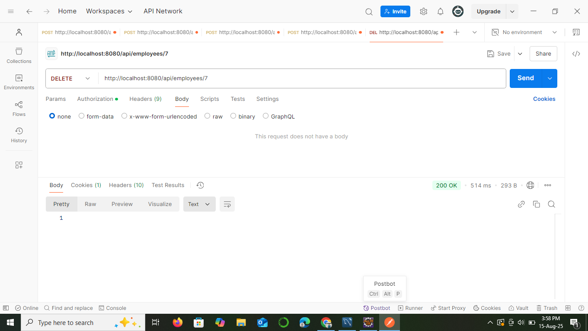

# Employee Management System

This is a simple, beginner-friendly **Spring Boot** application designed to manage employee data. It features full CRUD (Create, Read, Update, Delete) operations, role-based access control, search functionality, and basic statistical reporting.

## 🎯 Features

* **Employee CRUD Operations**: Add, update, and delete employee records.
* **Role-Based Access Control**: Different access levels for `ADMIN`, `MANAGER`, and `EMPLOYEE` roles.
* **Search and Filter**: Easily find employees by department or job title.
* **Reporting**: Generate real-time statistics on employee data.
* **Logging**: Actions are logged for auditing and error handling.
* **Testing**: Includes unit and integration tests using JUnit.

## 🚀 Technologies Used

* **Backend**: Java, Spring Boot
* **Database**: MySQL
* **API Testing**: Postman
* **IDE**: Eclipse

## 🔑 Role-Based Access Control

The application uses **Spring Security** to manage user permissions. Different roles have different access levels, which can be verified using the following credentials:

* **ADMIN**: `username: admin`, `password: adminpass` (Full access)
* **MANAGER**: `username: manager`, `password: managerpass` (Read-only access to employee list)
* **EMPLOYEE**: `username: employee`, `password: employeepass` (Read-only access to single employee record)

A **successful** request with a Manager's credentials shows their read-access is working.


An attempt to access a protected resource without the required role results in a **403 Forbidden** error, proving that security is enforced.


## 💻 API Endpoints

The application exposes a set of RESTful APIs. All endpoints require **HTTP Basic Authentication**.

### CRUD Operations

**Create (POST):** Add a new employee record. Requires `ADMIN` role.


**Read (GET):** Get all employee records. Requires `ADMIN` or `MANAGER` role.

**Update (PUT):** Update an existing employee. Requires `ADMIN` role.


**Delete (DELETE):** Delete an employee record. Requires `ADMIN` role.


### Search & Reporting

**Search by Department/Job Title:** Find employees based on specific criteria. Requires `ADMIN` or `MANAGER` role.

**Employee Statistics Report:** Get overall employee statistics. Requires `ADMIN` role.


**Top Paid Employees Report:** Get a list of the top 5 highest-paid employees. Requires `ADMIN` role.


### Installation

1.  **Clone the Repository**:
    ```bash
    git clone [https://github.com/Sinchana08/Employee_Management.git](https://github.com/Sinchana08/Employee_Management.git)
    ```
2.  **Database Setup**:
    * Create a MySQL database named `employee_management`.
    * Ensure your `application.properties` file in `src/main/resources` has the correct database credentials. The application will automatically create the `employees` table using JPA.
3.  **Run the Application**:
    * Open the project in Eclipse.
    * Right-click on `EmployeeManagementApplication.java` and select **Run As** > **Spring Boot App**.


